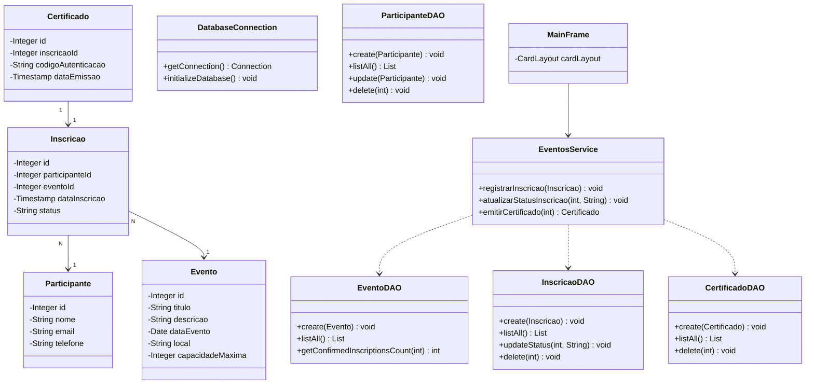

# Diagrama de Classes - EventFlow

Este documento descreve a estrutura de classes em formato UML utilizando sintaxe Mermaid.

```mermaid
classDiagram
    direction TB
    class Participante {
        -Integer id
        -String nome
        -String email
        -String telefone
    }
    class Evento {
        -Integer id
        -String titulo
        -String descricao
        -Date dataEvento
        -String local
        -Integer capacidadeMaxima
    }
    class Inscricao {
        -Integer id
        -Integer participanteId
        -Integer eventoId
        -Timestamp dataInscricao
        -String status
    }
    class Certificado {
        -Integer id
        -Integer inscricaoId
        -String codigoAutenticacao
        -Timestamp dataEmissao
    }
    class DatabaseConnection {
        +getConnection() Connection
        +initializeDatabase() void
    }
    class ParticipanteDAO {
        +create(Participante) void
        +listAll() List
        +update(Participante) void
        +delete(int) void
    }
    class EventoDAO {
        +create(Evento) void
        +listAll() List
        +getConfirmedInscriptionsCount(int) int
    }
    class InscricaoDAO {
        +create(Inscricao) void
        +listAll() List
        +updateStatus(int, String) void
        +delete(int) void
    }
    class CertificadoDAO {
        +create(Certificado) void
        +listAll() List
        +delete(int) void
    }
    class EventosService {
        +registrarInscricao(Inscricao) void
        +atualizarStatusInscricao(int, String) void
        +emitirCertificado(int) Certificado
    }
    class MainFrame {
        -CardLayout cardLayout
    }

    Inscricao "N" --> "1" Participante
    Inscricao "N" --> "1" Evento
    Certificado "1" --> "1" Inscricao
    EventosService ..> EventoDAO
    EventosService ..> InscricaoDAO
    EventosService ..> CertificadoDAO
    MainFrame --> EventosService
```
