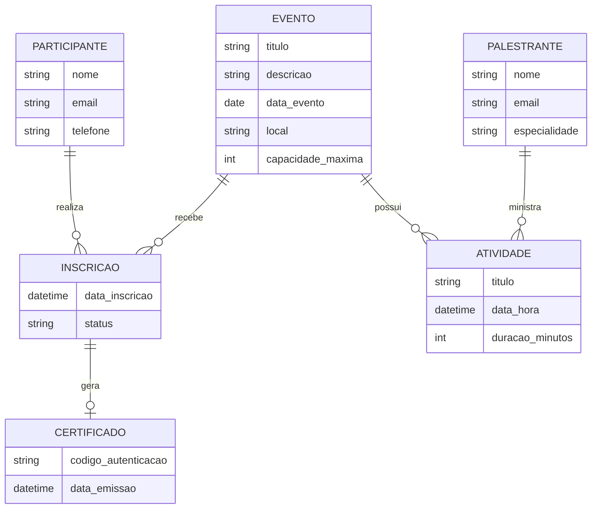

```mermaid
erDiagram

    PARTICIPANTE {
        string nome
        string email
        string telefone
    }

    EVENTO {
        string titulo
        string descricao
        date data_evento
        string local
        int capacidade_maxima
    }

    PALESTRANTE {
        string nome
        string email
        string especialidade
    }

    INSCRICAO {
        datetime data_inscricao
        string status
    }

    ATIVIDADE {
        string titulo
        datetime data_hora
        int duracao_minutos
    }

    CERTIFICADO {
        string codigo_autenticacao
        datetime data_emissao
    }

    PARTICIPANTE ||--o{ INSCRICAO : realiza
    EVENTO ||--o{ INSCRICAO : recebe
    EVENTO ||--o{ ATIVIDADE : possui
    PALESTRANTE ||--o{ ATIVIDADE : ministra
    INSCRICAO ||--o| CERTIFICADO : gera
```
